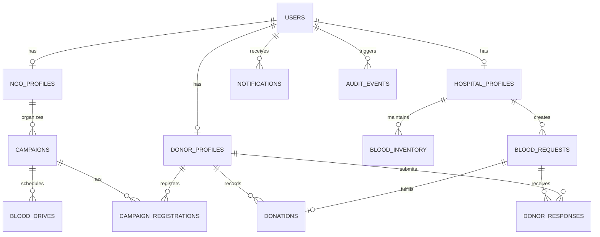
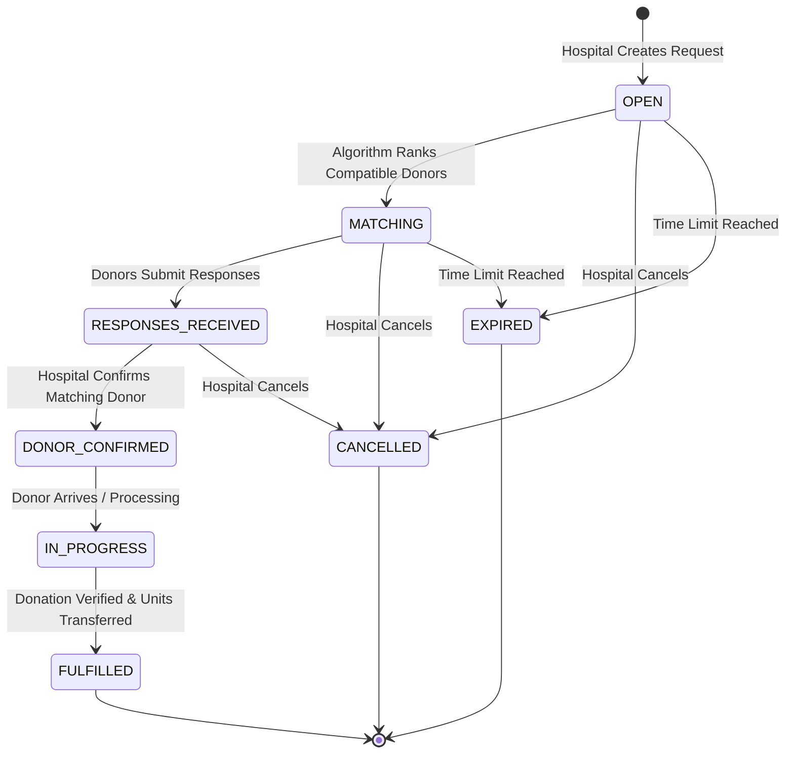

# Drop4Life — Phase 0: Architecture & Technical Specification

> **Official Website Name:** Drop4Life  
> **Brand Tagline:** "Every Drop Can Save a Life."  
> **Status:** Phase 0 Completed — Ready for Phase 1 Approval  

---

## 1. Executive Summary & Repository Inspection

### 1.1 Repository Inspection Baseline
- **Existing Codebase State:** Clean initial repository containing `DROP4LIFE_MASTER_PROMPT.md` and basic project README. No legacy code or conflicting frameworks present.
- **Project Mandate:** Build a modern, mission-critical, full-stack blood donation and emergency blood coordination platform connecting **Donors**, **Hospitals**, and **NGOs**.
- **Scope Policy:** Strictly incremental phased implementation with robust validation at each phase.

---

## 2. Branding & Design System Guidelines

### 2.1 Identity & Theme
- **Platform Name:** `Drop4Life` (Consistently applied across all headings, metadata, navbar, dashboards, email templates, and docs).
- **Tagline:** `Every Drop Can Save a Life.`
- **Visual Style:** Modern, trustworthy, accessible, clean healthcare aesthetic with high information density, crisp typography, and subtle micro-interactions.
- **Color Palette Tokens:**
  - **Primary:** Deep Blood Red (`#990000` / `hsl(0, 85%, 32%)`) with hover and active states (`#7A0000`, `#5C0000`)
  - **Accent / Secondary:** Coral / Soft Crimson (`#E63946`, `#FF4D6D`)
  - **Supporting Backgrounds:** Clean White (`#FFFFFF`), Soft Neutral Gray (`#F8FAFC`, `#F1F5F9`)
  - **Typography & Dark Contrast:** Slate/Charcoal (`#0F172A`, `#1E293B`, `#334155`)
  - **Status Indicators:**
    - Emergency / Critical: `#DC2626`
    - In Progress / Warning: `#F59E0B`
    - Fulfilled / Success: `#16A34A`
    - Info / Neutral: `#2563EB` / `#64748B`

---

## 3. Core Roles & Access Matrix

| Role | Access Scope | Core Responsibilities |
| :--- | :--- | :--- |
| **Public Visitor** | Public website, general compatibility checker, find blood (generalized), emergency request overview, public campaigns. | Learn about blood donation, check blood compatibility, search nearby blood drives/hospitals, register as donor/hospital/NGO. |
| **Donor** | `/donor/*` portal, profile, notification hub, eligibility status, donation logs. | View compatible blood requests, accept/decline donation invitations, view personal donation history, manage availability and privacy. |
| **Hospital** | `/hospital/*` portal, emergency request engine, inventory management, authorized matching, donor response tracker. | Create critical/emergency blood requests, monitor inventory levels (8 blood groups), manage donor matches and schedule fulfillment. |
| **NGO** | `/ngo/*` portal, campaign organizer, blood drive coordinator, donor mobilization, hospital collaboration. | Create and manage blood donation campaigns, coordinate public blood drives, track campaign participation and aggregate donation records. |

---

## 4. Complete Route Map & Information Architecture

### 4.1 Public Routes
- `/` — Landing page (Hero, Quick blood group stats, How it works, Emergency CTA, Testimonials/Impact metrics)
- `/about` — Platform mission, safety guidelines, and clinical disclaimer
- `/find-blood` — Filterable directory of participating hospitals and open requests (with map & list views)
- `/blood-compatibility` — Interactive ABO/Rh 8-group compatibility matrix and educational visualizer
- `/blood-network` — Participating hospitals and registered NGO network directory
- `/emergency` — Dedicated urgent blood request awareness and escalation page
- `/contact` — Support and feedback inquiries
- `/login` — Unified role-aware authentication portal (Donor, Hospital, NGO)
- `/register/donor` — Donor onboarding (blood group, location, contact, availability)
- `/register/hospital` — Hospital verification onboarding (license, department, location)
- `/register/ngo` — NGO verification onboarding (registration ID, mission, coverage)

### 4.2 Donor Portal (`/donor/*`)
- `/donor/dashboard` — Overview: eligibility timer, recent requests, donation milestone tracker, quick availability toggle
- `/donor/requests` — View & respond to incoming hospital blood requests (Accept / Decline / Details)
- `/donor/donations` — Historical timeline of completed donations with certificates/records
- `/donor/compatibility` — Personalized compatibility view based on donor's blood group
- `/donor/notifications` — Notification center for emergency alerts and drive invites
- `/donor/profile` — Medical history summary, approximate location, blood group, contact info
- `/donor/settings` — Privacy settings, alert frequency, account credentials

### 4.3 Hospital Portal (`/hospital/*`)
- `/hospital/dashboard` — Live emergency request radar, low-inventory alerts, donor response queue
- `/hospital/requests` — Full request management lifecycle (Create, Filter, Monitor, Match, Fulfill, Cancel)
- `/hospital/requests/new` — Emergency request creation wizard with priority tagging (Critical, Emergency, Urgent, Normal)
- `/hospital/inventory` — 8-group stock tracker with configurable threshold alerts
- `/hospital/donors` — Responded/matched donor coordination interface
- `/hospital/network` — Inter-hospital and NGO collaboration directory
- `/hospital/reports` — Analytics on fulfillment rates, group demand, response times
- `/hospital/notifications` — Urgent response alerts and inventory triggers
- `/hospital/profile` — Hospital accreditation, address, coordinates, emergency contact
- `/hospital/settings` — Threshold configs, staff accounts, alert webhooks

### 4.4 NGO Portal (`/ngo/*`)
- `/ngo/dashboard` — Active campaigns summary, donor volunteer count, upcoming blood drives
- `/ngo/campaigns` — Campaign planner (Create, Edit, Set target units, Track progress)
- `/ngo/blood-drives` — Scheduled community blood drives with location & partner hospitals
- `/ngo/donors` — Consented donor directory and mobilization management
- `/ngo/hospitals` — Partner hospital coordination and mutual aid
- `/ngo/requests` — Community assistance requests
- `/ngo/reports` — Campaign impact metrics, blood group distribution charts
- `/ngo/notifications` — Campaign alerts and volunteer confirmations
- `/ngo/profile` — NGO verification details, coverage region, contact
- `/ngo/settings` — Notification preferences, team access

---

## 5. Comprehensive Data Model



### 5.1 Entities Specification
1. **`users`**: `id (UUID)`, `email (string)`, `role ('donor' | 'hospital' | 'ngo' | 'admin')`, `status ('active' | 'suspended' | 'pending_verification')`, `created_at`, `updated_at`.
2. **`donor_profiles`**: `id (UUID)`, `user_id (FK)`, `full_name (string)`, `blood_group ('O-'|'O+'|'A-'|'A+'|'B-'|'B+'|'AB-'|'AB+')`, `phone (string)`, `city (string)`, `latitude (float)`, `longitude (float)`, `is_available (boolean)`, `last_donated_at (timestamp)`, `privacy_level ('approximate' | 'hidden')`.
3. **`hospital_profiles`**: `id (UUID)`, `user_id (FK)`, `hospital_name (string)`, `license_number (string)`, `department (string)`, `phone (string)`, `emergency_phone (string)`, `address (text)`, `city (string)`, `latitude (float)`, `longitude (float)`, `is_verified (boolean)`.
4. **`ngo_profiles`**: `id (UUID)`, `user_id (FK)`, `organization_name (string)`, `registration_id (string)`, `contact_person (string)`, `phone (string)`, `coverage_area (string)`, `is_verified (boolean)`.
5. **`blood_requests`**: `id (UUID)`, `hospital_id (FK)`, `blood_group (enum)`, `units_needed (int)`, `priority ('CRITICAL' | 'EMERGENCY' | 'URGENT' | 'NORMAL')`, `status ('OPEN' | 'MATCHING' | 'RESPONSES_RECEIVED' | 'DONOR_CONFIRMED' | 'IN_PROGRESS' | 'FULFILLED' | 'CANCELLED' | 'EXPIRED')`, `department (string)`, `required_by (timestamp)`, `authorized_reference (string)`, `notes (text)`, `created_at`, `updated_at`.
6. **`donor_responses`**: `id (UUID)`, `request_id (FK)`, `donor_id (FK)`, `status ('INVITED' | 'ACCEPTED' | 'DECLINED' | 'CONFIRMED' | 'COMPLETED' | 'NO_SHOW')`, `distance_km (float)`, `responded_at (timestamp)`.
7. **`donations`**: `id (UUID)`, `donor_id (FK)`, `hospital_id (FK)`, `request_id (FK nullable)`, `blood_group (enum)`, `units (int)`, `donation_date (date)`, `status ('SCHEDULED' | 'COMPLETED' | 'CANCELLED')`, `verification_code (string)`.
8. **`blood_inventory`**: `id (UUID)`, `hospital_id (FK)`, `blood_group (enum)`, `units_available (int)`, `low_stock_threshold (int)`, `last_updated_at (timestamp)`.
9. **`campaigns`**: `id (UUID)`, `ngo_id (FK)`, `partner_hospital_id (FK nullable)`, `title (string)`, `description (text)`, `start_date (timestamp)`, `end_date (timestamp)`, `location_name (string)`, `target_units (int)`, `collected_units (int)`, `status ('PLANNED' | 'ACTIVE' | 'COMPLETED' | 'CANCELLED')`.
10. **`campaign_registrations`**: `id (UUID)`, `campaign_id (FK)`, `donor_id (FK)`, `registered_at (timestamp)`, `attendance_status ('REGISTERED' | 'ATTENDED' | 'MISSED')`.
11. **`notifications`**: `id (UUID)`, `user_id (FK)`, `type (string)`, `title (string)`, `message (text)`, `link (string)`, `is_read (boolean)`, `created_at (timestamp)`.
12. **`audit_events`**: `id (UUID)`, `actor_id (FK)`, `action (string)`, `entity_type (string)`, `entity_id (UUID)`, `details (JSONB)`, `ip_address (string)`, `created_at (timestamp)`.

---

## 6. Business Logic & State Machines

### 6.1 Blood Compatibility Engine (8 ABO/Rh Types)

```
Donor Group  -> Compatible Recipient Groups (Can Give To)
-------------------------------------------------------
O-           -> O-, O+, A-, A+, B-, B+, AB-, AB+ (Universal Red Cell Donor)
O+           -> O+, A+, B+, AB+
A-           -> A-, A+, AB-, AB+
A+           -> A+, AB+
B-           -> B-, B+, AB-, AB+
B+           -> B+, AB+
AB-          -> AB-, AB+
AB+          -> AB+ (Universal Red Cell Recipient)

Recipient Group -> Compatible Donor Groups (Can Receive From)
-------------------------------------------------------
O-              -> O-
O+              -> O-, O+
A-              -> O-, A-
A+              -> O-, O+, A-, A+
B-              -> O-, B-
B+              -> O-, O+, B-, B+
AB-             -> O-, A-, B-, AB-
AB+             -> All groups (O-, O+, A-, A+, B-, B+, AB-, AB+)
```
*Note: Always accompanied by the clinical disclaimer that compatibility displays are informational and do not replace clinical crossmatching or blood-bank clearance.*

### 6.2 Emergency Request State Lifecycle



### 6.3 Smart Donor Matching Criteria & Score
- **Rule 1: Blood Compatibility (Strict Filter):** Candidate donor must be capable of giving red blood cells to the requested group.
- **Rule 2: Availability (Strict Filter):** `is_available === true`.
- **Rule 3: Donation Interval Eligibility:** `last_donated_at` >= 90 days ago (or null).
- **Rule 4: Geographic Proximity Scoring:** Distance calculated via Haversine formula from request location.
- **Rule 5: Urgency Weighting:** Weighted scoring prioritizing closer active donors for `CRITICAL` and `EMERGENCY` priority requests.

---

## 7. Technology Stack & Directory Structure

```
Drop4Life/
├── app/
│   ├── (auth)/
│   │   ├── login/
│   │   └── register/
│   │       ├── donor/
│   │       ├── hospital/
│   │       └── ngo/
│   ├── (public)/
│   │   ├── about/
│   │   ├── blood-compatibility/
│   │   ├── blood-network/
│   │   ├── contact/
│   │   ├── emergency/
│   │   ├── find-blood/
│   │   └── page.tsx (Landing)
│   ├── donor/
│   │   ├── dashboard/
│   │   ├── donations/
│   │   ├── notifications/
│   │   ├── profile/
│   │   ├── requests/
│   │   └── settings/
│   ├── hospital/
│   │   ├── dashboard/
│   │   ├── donors/
│   │   ├── inventory/
│   │   ├── network/
│   │   ├── notifications/
│   │   ├── profile/
│   │   ├── reports/
│   │   ├── requests/
│   │   │   ├── new/
│   │   │   └── [id]/
│   │   └── settings/
│   ├── ngo/
│   │   ├── blood-drives/
│   │   ├── campaigns/
│   │   ├── dashboard/
│   │   ├── donors/
│   │   ├── hospitals/
│   │   ├── notifications/
│   │   ├── profile/
│   │   ├── reports/
│   │   ├── requests/
│   │   └── settings/
│   ├── api/
│   │   ├── auth/
│   │   ├── compatibility/
│   │   ├── emergency/
│   │   ├── matching/
│   │   └── requests/
│   ├── layout.tsx
│   └── globals.css
├── components/
│   ├── ui/               # Reusable atomic design system
│   ├── common/           # Navbars, footers, breadcrumbs, modal dialogs
│   ├── public/           # Landing page & informational components
│   ├── donor/            # Donor-specific components & cards
│   ├── hospital/         # Hospital request & inventory components
│   ├── ngo/              # Campaign & drive components
│   └── maps/             # Leaflet & location map visualizers
├── lib/
│   ├── compatibility.ts  # Clinical rule engine
│   ├── matching.ts       # Donor ranking & distance algorithm
│   ├── mock-data.ts      # Seeded, clearly labeled demo data
│   ├── supabase.ts       # DB client & schemas
│   ├── types.ts          # Strict TypeScript interfaces
│   └── utils.ts          # Helpers & formatters
├── docs/
│   └── PHASE_0_SPECIFICATION.md
└── tests/
    ├── unit/
    └── e2e/
```

---

## 8. Implementation Roadmap (Phases 1 to 16)

- [ ] **Phase 1: Project Foundation & Reusable Design System** (Next.js 14/15 App Router, Tailwind CSS, shadcn-inspired atomic component tokens, layout shells).
- [ ] **Phase 2: Public Website & Landing Page** (Hero, 8-group quick compatibility banner, find blood preview, emergency CTA, how it works, impact counters).
- [ ] **Phase 3: Authentication, Registration & Role Authorization** (Role-aware login with Donor/Hospital/NGO selection, demo accounts, route guards, session provider).
- [ ] **Phase 4: Blood Compatibility Engine** (Deterministic 8-group ABO/Rh matrix calculation, visual interactive component with safety disclaimers).
- [ ] **Phase 5: Donor Portal** (Dashboard, eligibility gauge, incoming requests, donation logs, profile, availability toggle).
- [ ] **Phase 6: Smart Donor Matching** (Multi-factor ranking: compatibility, proximity, availability, response history).
- [ ] **Phase 7: Hospital Portal** (Dashboard, emergency request builder, live donor response tracking, 8-group blood inventory manager).
- [ ] **Phase 8: NGO Portal** (Campaign management, community blood drive scheduler, donor mobilization).
- [ ] **Phase 9: Find Blood & Interactive Maps** (Leaflet integration, hospital & blood drive map markers, radius filtering).
- [ ] **Phase 10: Emergency Response Workflow** (Full 8-stage state machine from OPEN to FULFILLED, audit logs, confirmation flows).
- [ ] **Phase 11: Real-Time Notifications** (Dropdown bell, unread count, contextual notifications for requests & responses).
- [ ] **Phase 12: Reports & Analytics** (Recharts integration for donor impact, hospital demand by group, NGO drive yields).
- [ ] **Phase 13: Profiles & Settings** (Role-specific settings, notification preferences, security & privacy controls).
- [ ] **Phase 14: Persistent Backend & Data Integration** (PostgreSQL/Supabase schemas, RLS policies, migrations, mock-to-live toggle).
- [ ] **Phase 15: Reference-Based Visual Refinement** (Polished healthcare UI review, spacing, micro-animations, color accessibility).
- [ ] **Phase 16: Full QA & Production-Readiness Audit** (Unit tests for compatibility & state transitions, E2E tests, build audit).

---

## 9. Phase 0 Completion & Sign-off Checklist
- [x] Repository inspected; clean baseline established.
- [x] Brand naming standard confirmed: `Drop4Life` and tagline `"Every Drop Can Save a Life."`.
- [x] Three-role architecture defined (Donor, Hospital, NGO).
- [x] Comprehensive route map documented across public and protected spaces.
- [x] Relational schema and entities modeled with strict typings.
- [x] State machines defined for Blood Compatibility and Emergency Request lifecycles.
- [x] Phased roadmap structured into 16 discrete, testable milestones.
- [x] No dashboard implementations begun prior to Phase 1 authorization.
